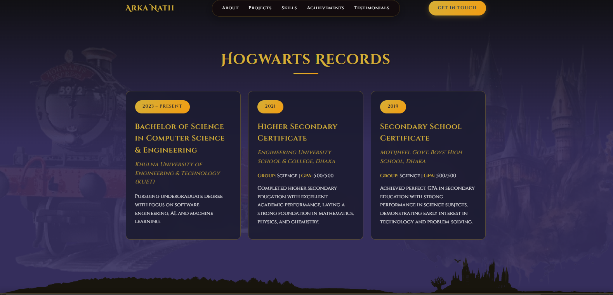

# Arka Braja Prasad Nath - Portfolio

A magical Harry Potter-themed portfolio website showcasing my journey as a Computer Science & Engineering student at KUET. This portfolio combines modern web technologies with the enchanting aesthetics of the wizarding world.


## 🎬 **Live Demo & Video Walkthrough**

📹 **Watch the Portfolio in Action**: [Portfolio Demo Video](https://drive.google.com/drive/u/0/folders/1xKOpEkvkJDJ6KoFzL2-Ux_if0OnPBvnv)

_Experience the magical journey through my portfolio with a complete video demonstration showcasing all features, animations, and functionality._

---

### Features

### **Magical User Interface**

- **Harry Potter Theme**: Custom fonts, colors, and magical aesthetics throughout
- **Responsive Design**: Seamlessly adapts to all device sizes
- **Smooth Animations**: Engaging transitions and hover effects
- **Interactive Elements**: Dynamic components with magical touches

### **Portfolio Sections**

#### **Hero Section - "Welcome to My Portfolio"**

- Custom Harry Potter font (`HARRYP__.TTF`)
- Elegant gradient backgrounds
- Professional CTA button with hover effects
- Background image with opacity overlay


#### **The Marauder's Map (About Section)**

- Parchment-style background design
- Personal introduction and skills overview
- Professional summary with magical theming


#### **The Spellbook (Projects Section)**

- Interactive project slider with navigation
- Dynamic project cards with hover effects
- Technology tags and live demo links
- GitHub repository links


#### **Wand Armory (Skills Section)**

- Categorized skill display with tabs
- Circular progress indicators
- Interactive skill categories
- Visual proficiency ratings


#### **Gringotts Vault (Achievements Section)**

- Flip card animations
- Newspaper-style achievement cards
- Date and category organization
- Professional achievement showcase


#### 📰 **The Room of Requirement (Extracurricular Activities)**

- Daily Prophet newspaper clippings design
- Moving picture effects
- Real project images integration
- Activities timeline presentation


#### 🎓 **Hogwarts Records (Education Section)**

- Timeline-based education display
- Academic achievements highlighting
- Institution details and GPAs
- Clean, professional layout



#### 💬 **The Daily Prophet (Testimonials)**

- Parchment note design
- Star ratings system
- Client/colleague feedback
- Carousel slider presentation


#### 📧 **Send Me an Owl (Contact Section)**

- Magical contact form design
- Real-time form validation
- Professional contact information
- Social media integration


### **Cookie Management System**

- GDPR-compliant cookie consent
- Customizable cookie preferences
- Professional cookie settings modal
- Analytics and marketing cookie controls


### 🛡️ **Admin Panel & Management System**

- Complete content management dashboard
- Secure admin authentication
- Project, skills, and achievement management
- Testimonial and message handling
- Professional admin interface


## **Technology Stack**

### **Frontend**

- **HTML5**: Semantic markup and structure
- **CSS3**: Advanced styling with gradients, animations, and responsive design
- **JavaScript (ES6+)**: Interactive functionality and dynamic content
- **PHP**: Server-side rendering and database integration

### **Backend & Database**

- **PHP**: Server-side logic and form handling
- **MySQL**: Database for projects, skills, achievements, and testimonials
- **PDO**: Secure database connections and queries

### **Design & Assets**

- **Custom Fonts**: Harry Potter themed typography
- **Responsive Images**: Optimized for all devices
- **CSS Animations**: Smooth transitions and hover effects
- **Glass Morphism**: Modern UI design trends

### **Features & Functionality**

- **Contact Form**: Email integration with validation
- **Admin Panel**: Content management system
- **Cookie Management**: GDPR compliance
- **Mobile Navigation**: Responsive menu system
- **Image Optimization**: Fast loading and responsive images

## **Project Structure**

```
Portfolio/
├── index.php                 # Main portfolio page
├── config.php                # Database configuration
├── style.css                 # Main stylesheet
├── script.js                 # JavaScript functionality
├── admin/                    # Admin panel for content management
│   ├── dashboard.php         # Admin dashboard
│   ├── projects.php          # Project management
│   ├── skills.php            # Skills management
│   ├── achievements.php      # Achievement management
│   ├── testimonials.php      # Testimonial management
│   └── messages.php          # Contact message management
├── images/                   # Image assets
│   ├── projectsImage/        # Project-specific images
│   └── portfolioImage/       # Portfolio section screenshots
├── font/                     # Custom fonts
│   └── HARRYP__.TTF          # Harry Potter font
└── database.sql              # Database schema
```

## **Getting Started**

### **Prerequisites**

- Web server (Apache/Nginx)
- PHP 7.4 or higher
- MySQL 5.7 or higher
- Modern web browser

### **Installation**

1. **Clone the repository**

   ```bash
   git clone https://github.com/AriyaArKa/Portfolio.git
   cd Portfolio
   ```

2. **Set up database**

   - Import `database.sql` into your MySQL database
   - Update database credentials in `config.php`

3. **Configure web server**

   - Place files in your web server document root
   - Ensure PHP and MySQL are running

4. **Access the portfolio**
   - Navigate to `http://localhost/Portfolio` in your browser

### **Admin Panel Access**

- URL: `http://localhost/Portfolio/admin`
- Manage all portfolio content through the admin interface

## **Database Schema**

### **Tables**

- `projects`: Portfolio projects with descriptions, technologies, and links
- `skills`: Technical skills with categories and proficiency levels
- `achievements`: Professional achievements with dates and descriptions
- `testimonials`: Client/colleague feedback and ratings
- `messages`: Contact form submissions
